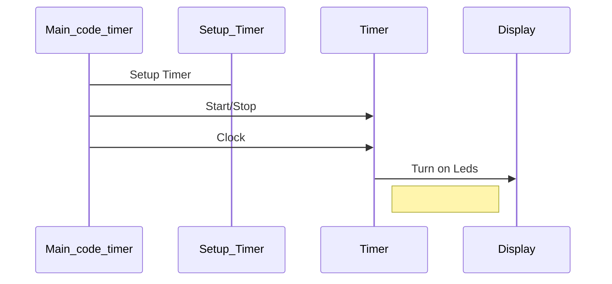

# CrossFit Timer

Hi ! 
I did this project because I wanted to build a Crossfit Timer that I used during the lockdown. It's better that a phone or computer and a real one is pretty much expensive.
Modes I did : count up, count down, interval, the possibility to set rounds and a basic clock mode.

## Table of contents

-   [Manufacturing](https://github.com/VDosda/Crossfit_Timer#manufacturing)
-   [Electronic](https://github.com/VDosda/Crossfit_Timer#electronic)
-   [Code](https://github.com/VDosda/Crossfit_Timer#code)
-   [Documentation](https://github.com/VDosda/Crossfit_Timer#documentation)
-   [Creator](https://github.com/VDosda/Crossfit_Timer#creator)

## Manufacturing

### Softwares :
- Fusion 360
- Cura

### 3D Printer :
- [Alfawise u20](https://fr.gearbest.com/3d-printers-3d-printer-kits/pp_1841229.html?vip=80634280&gclid=CjwKCAiAi_D_BRApEiwASslbJ_neQlq8nd4rkhrzwSbTG8Y6fiAYh2CJZcF7eu1_qxLPm5mZDWg6XRoCLWgQAvD_BwE)
- [Black AmazonBasics PLA Filament,1.75mm](https://www.amazon.fr/AmazonBasics-PLA-Printer-Filament-1-75mm/dp/B07FW5BZKC)

### Other :
- [Black Car Window Foils Tint](https://www.aliexpress.com/item/4000479123439.html?spm=a2g0s.9042311.0.0.27426c37jiLaNj)
- [M3 Inserts Brass](https://www.aliexpress.com/item/32842866575.html?spm=a2g0s.9042311.0.0.27424c4d6tyr0m)
- [M3 Screw](https://www.aliexpress.com/item/10000181324125.html?spm=a2g0s.9042311.0.0.27424c4d6tyr0m)
- [Translucent paper](https://www.google.com/search?q=translucent+paper&tbm=isch&sxsrf=ALeKk03G3xllpZQCuisPQwcTahbYbgK15Q:1610404205705&source=lnms&sa=X&ved=0ahUKEwigvoCV95TuAhXATxUIHVI7BMoQ_AUIqggoAQ&biw=1434&bih=804)
- [Brass Standoff Spacer PCB](https://www.aliexpress.com/item/32852244734.html?spm=a2g0s.9042311.0.0.27424c4d6tyr0m)

## Electronic

### Softwares :
- EasyEDA
- Fritzing

### PCB:
- [JLCPCB](https://jlcpcb.com/?gclid=CjwKCAiAi_D_BRApEiwASslbJ3z_7JnghO51ybtPCfLTmgLIY_EPknub1aJ6jTnIsRFJ7isGv1mDUhoCed0QAvD_BwE)

### Components
- Arduino nano
- Real Time Clock (RTC)
- Tactile Push Button
- Resistors
- Capacitors
- Leds SK6812
- Buzzer
- Rechargeable Battery Lipo cells
- Lipo Charger Module
- 5V DC-DC Step-Up Power Module
- Slide switch

## Code

### Softwares :
- Arduino IDE

## UML diagrams

How the code works:

